# An Easy-to-Use RPI Pico PIO Emulator

This is a simple tool for emulating behavior of **single** state machine in RPI Pico PIO. The tool 
is almost independent of OS environment (Linux, Windows etc.) and only requires a standard C/C++ 
compiler.

## 1. Overall Design Flow

The provided design flow is shown below. Unlike other similar debugging environments, the source file 
is not a standard PIO assembler code, i.e, ".pio" code. 
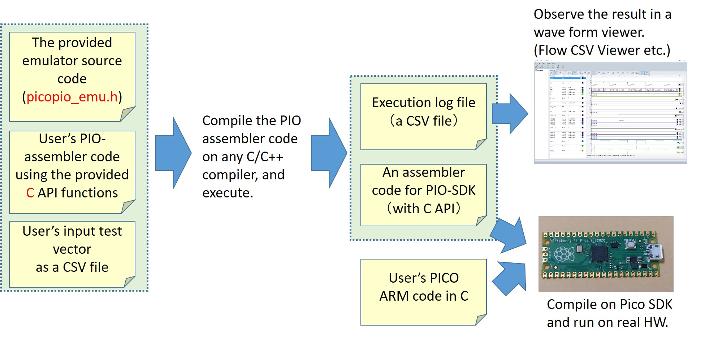

 

(Step 1) Write an assembler code **in C language**, by calling the provided C functions which correspond 
to assembler instructions, like PIO coding in Micro Python. A list of the C functions will be shown 
later in Section 2, and an example code is
[here](https://github.com/sumio-morioka/rpipico_simple_PIO_emulator/blob/main/sample1/emu/emu_main.c "A sample assembler code").

(Step 2) Compile your source with the provided emulator source (a C header file 
["**picopio_emu.h**"](https://github.com/sumio-morioka/rpipico_simple_PIO_emulator/blob/main/picopio_emu.h "Emulator program")
), and you will get a binary executable. 

(Step 3) Run the binary with 
[an input vector CSV file](https://github.com/sumio-morioka/rpipico_simple_PIO_emulator/blob/main/sample1/emu/in.csv "A sample input CSV"). 
[An output trace CSV file](https://github.com/sumio-morioka/rpipico_simple_PIO_emulator/blob/main/sample1/emu/Project1/x64/Release/out.csv "a sample output CSV")
and 
[an assembler source (.pio code)](https://github.com/sumio-morioka/rpipico_simple_PIO_emulator/blob/main/sample1/src/pio0_sm0.pio "A generated pio file")
for Pico SDK will be generated. You can observe the execution result by free 
[Flow CSV Viewer](https://apps.microsoft.com/store/detail/flow-csv-viewer/9NQ7Z06VRXBW "Flow CSV Viewer")
etc. The assembler source include a C API function for initializing state machine.

(Step 4) Write your Pico application in C and build with the assembler source generated in Step 3.
Here is an [example](https://github.com/sumio-morioka/rpipico_simple_PIO_emulator/blob/main/sample1/src/myapp.c "PICO application example").

  

There are important limitations in this environment, as shown in this table.

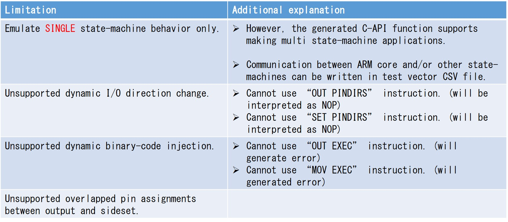
 

## 2. Preparation of PIO Assembler Code (Important: In C)

Write your assembler code (
[sample](https://github.com/sumio-morioka/rpipico_simple_PIO_emulator/blob/main/sample1/emu/emu_main.c "A sample assembler code")
) using C functions in the following three tables. The first table is a list of emulator control
functions. Call pio_code_start(), pio_code_end() and pio_run_emulation() in this order. A function 
pio_code_start_simple() is just a simplified version of pio_code_start().

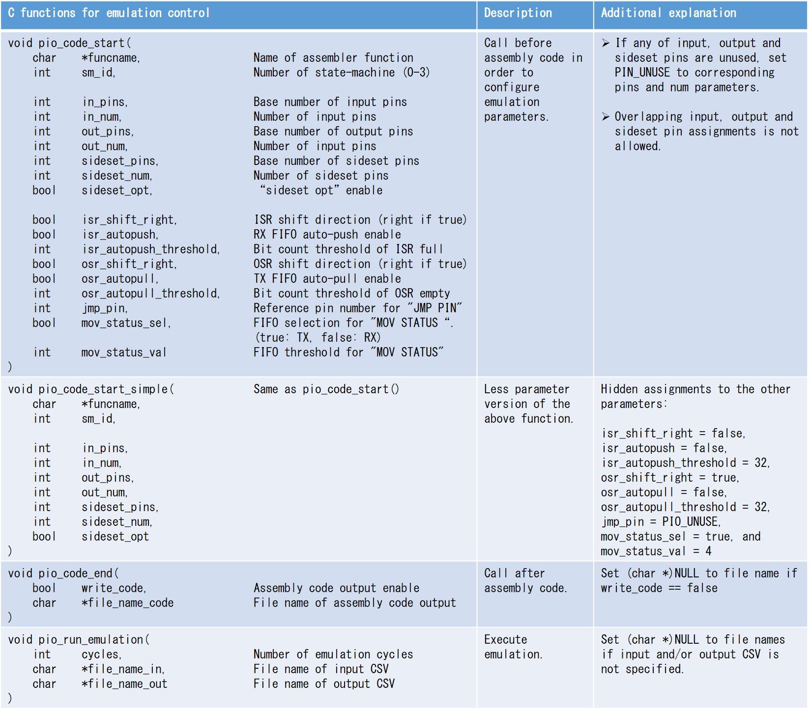
 

Use these functions to write your assembly code. Each function corresponds to PIO instruction. Assembly 
code should be located between pio_code_start() and pio_code_end().

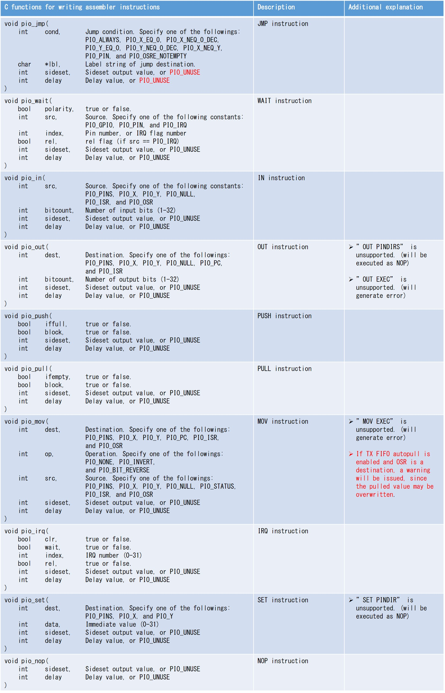
 

The following functions correspond to pseudo instructions.

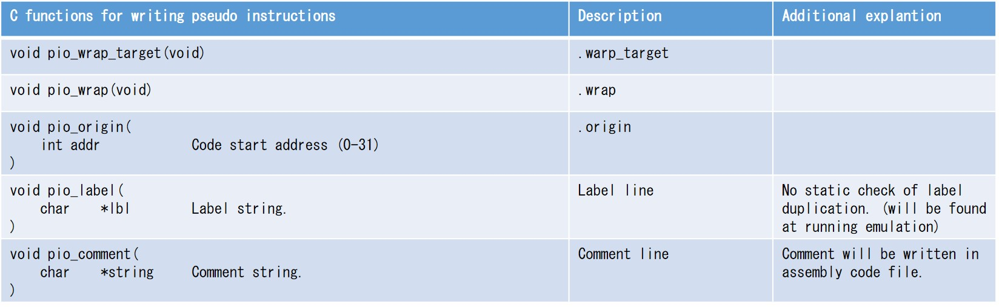
 

You can use the following prameters to control emulation input and output. Place these definitions
**before** including picopio_emu.h.

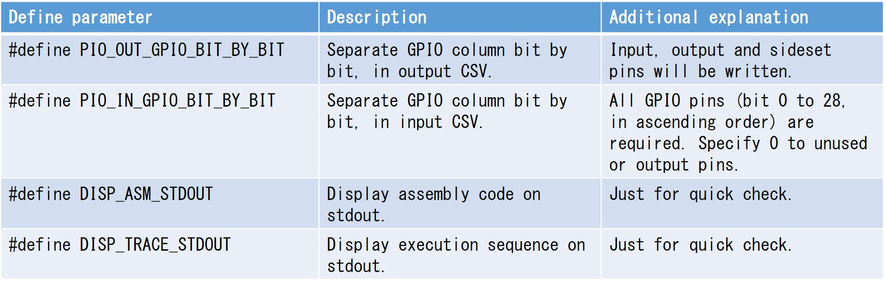
 

## 3. Preparation of Input Test Vector

Write an input data as a CSV file
[(sample)](https://github.com/sumio-morioka/rpipico_simple_PIO_emulator/blob/main/sample1/emu/in.csv "A sample input CSV")
, if your program refers GPIO, IRQ and/or . The meanings of each column are shown below.

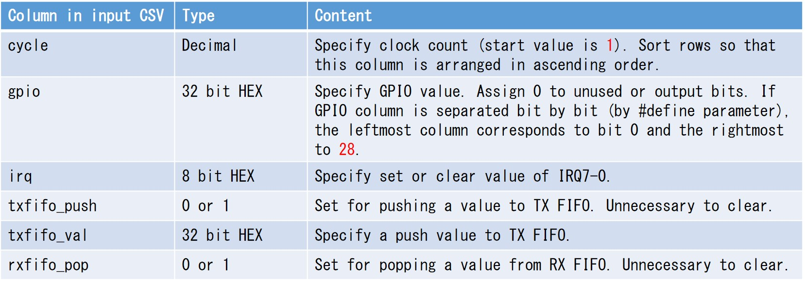
 

## 4. Emulation and Observation of the Results

Compile your program by conventional C/C++ compilers such as gcc and Visual Studio. Then simply run the prograum.

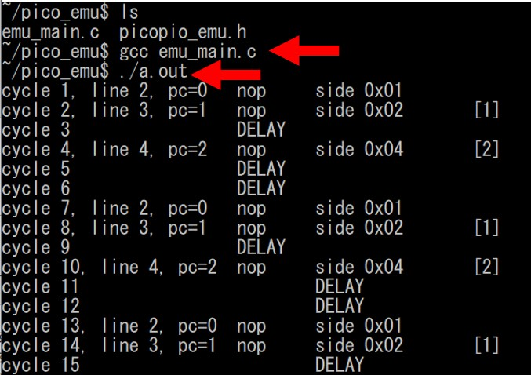
 

Two output files will be generated. One is an execution trace file
[(sample)](https://github.com/sumio-morioka/rpipico_simple_PIO_emulator/blob/main/sample1/emu/Project1/x64/Release/out.csv "a sample output CSV")
. The file is in CSV format and each columns are defined below. The other is a ".pio" file (assembler
source) for building Pico executable binary.

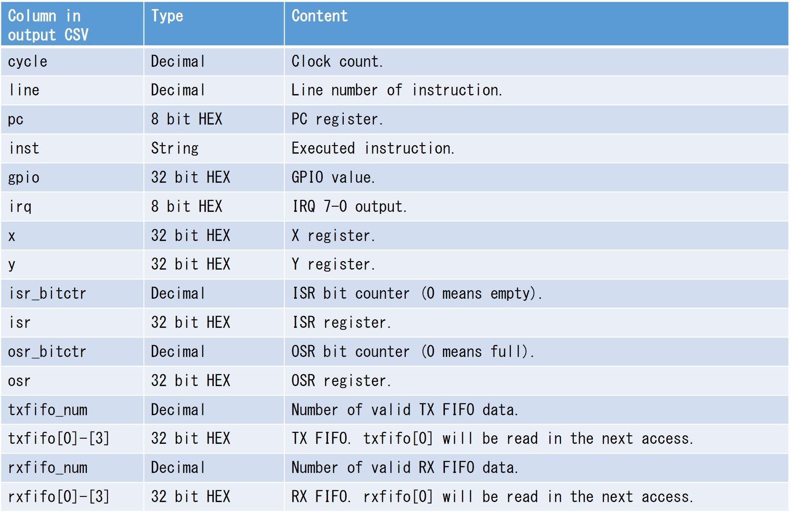
 

While the generated CSV is readable, it will be better to use a free waveform viewer such as
[Flow CSV Viewer](https://apps.microsoft.com/store/detail/flow-csv-viewer/9NQ7Z06VRXBW "Flow CSV Viewer").

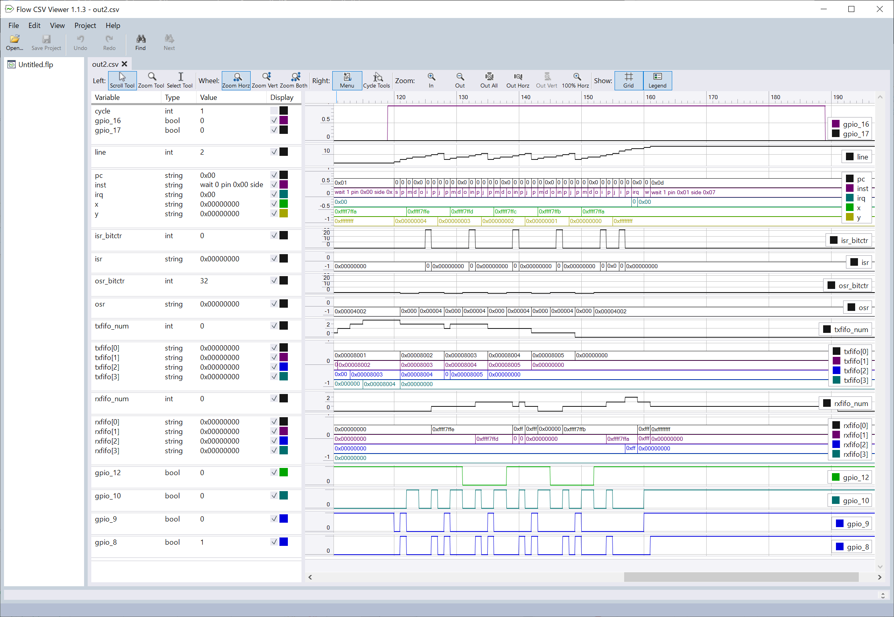
 

## 5. Preparation of Pico ARM Code in C

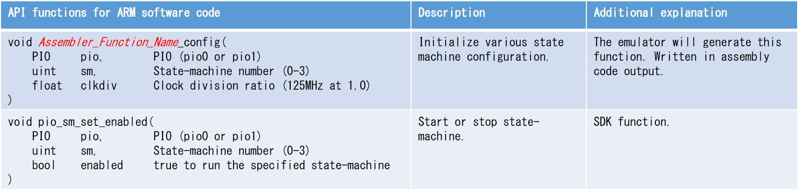
 

## 6. Build for Real Hardware

## 7. Brief Explanation of Code Examples
### 7.1 Sample 1

Demonstration of simple waveform output.

### 7.2 Sample 2

Demonstration of IRQ and multiple state-machines.
